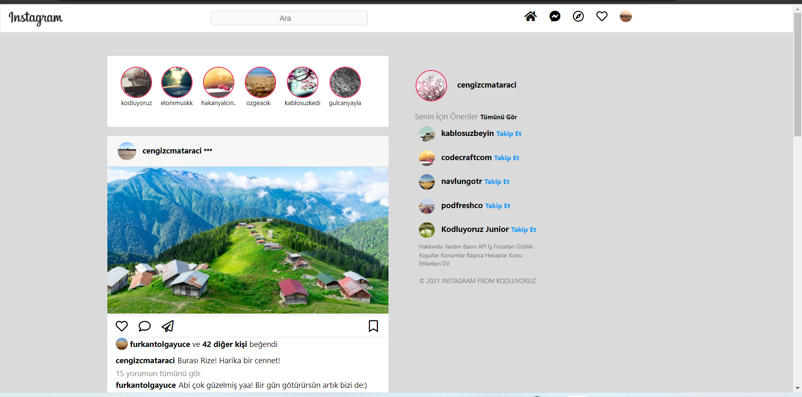
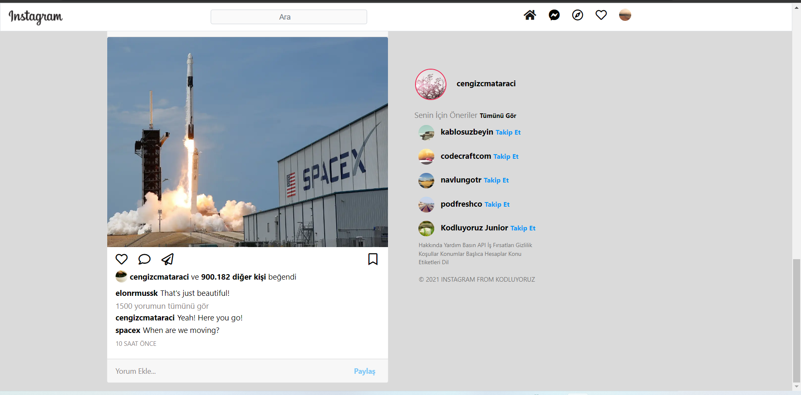

# Bootstrap ile Instagram Clone

Bu repo [kodluyoruz](https://kodluyoruz.org/) Front-end eğitimde oluşturduğumuz Bootstrap ödev2 Bootstrap ile Instagram Clone adı altında on birinci repodur. İçerisinde bir adet README.md dosyası, bir adet de index.html, bir adet images dosyası, bir adet css dosyası, bir adet assets dosyası barındırıyor.

## Simple HTML Instagram clone made with Bootstrap.

## Hesaplarım 
Github [click](https://github.com/cetinyazici) !

LinkedIn [click](https://www.linkedin.com/in/cetinyazici/) !

Patika.dev [click](https://app.patika.dev/yazilimyazici) !